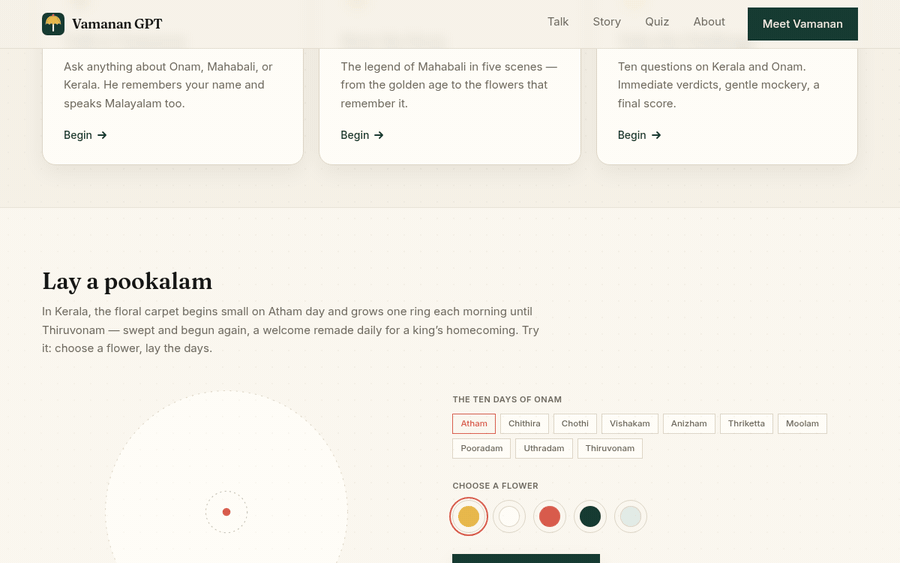
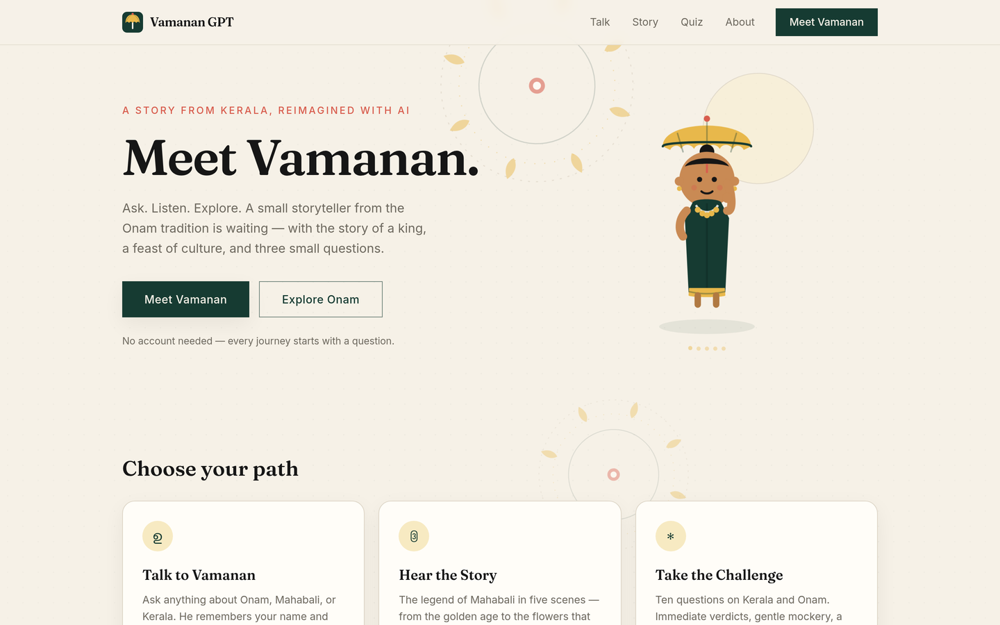
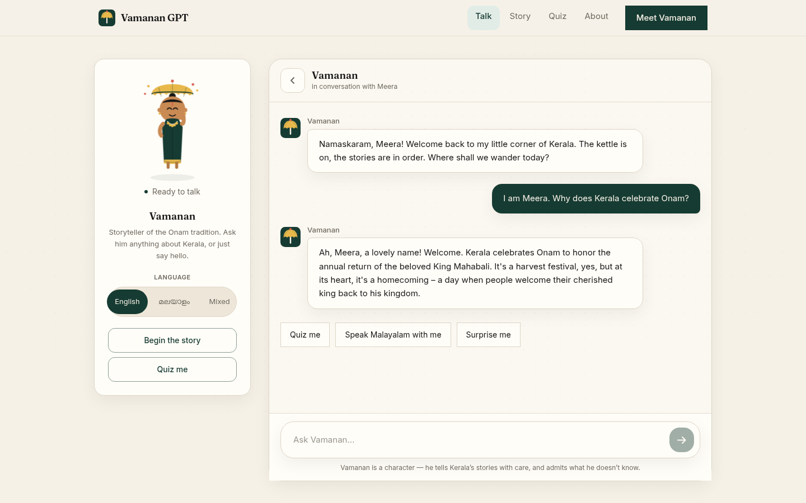
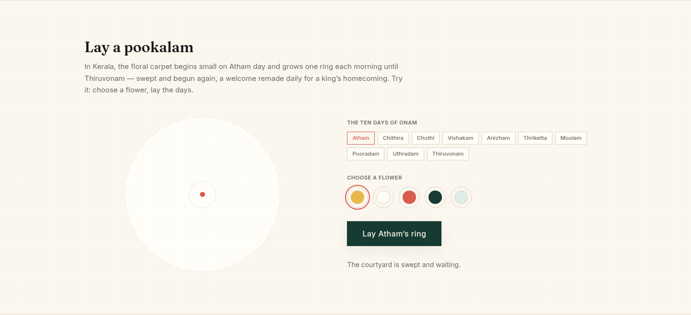
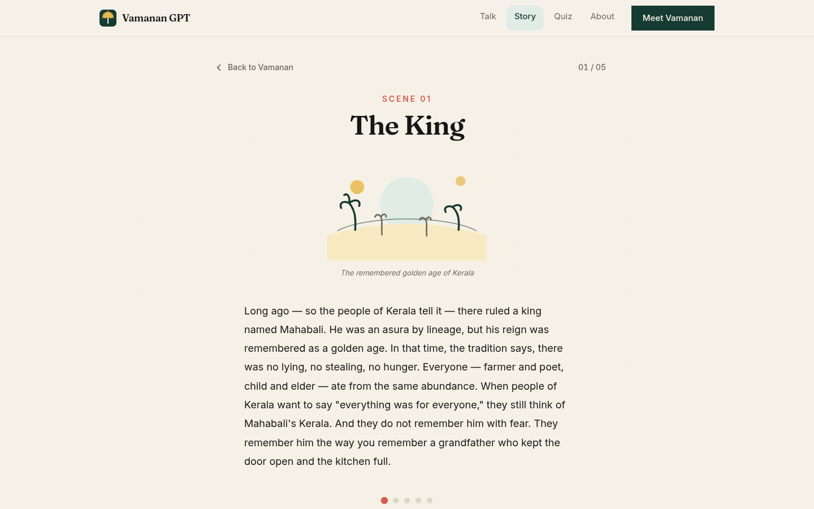
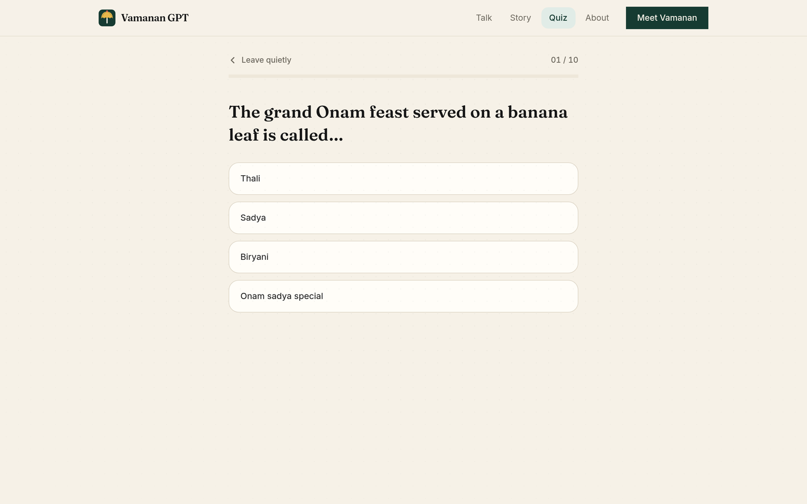
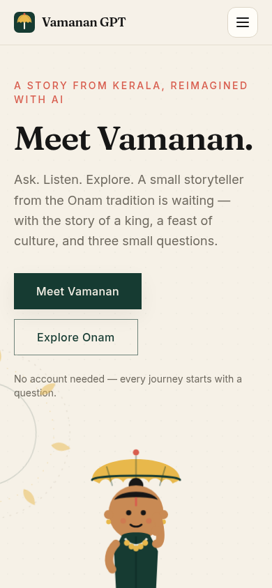

<div align="center">

<!-- logo -->
<a href="https://vamanan-gpt.vercel.app">
  <picture>
    <source media="(prefers-color-scheme: dark)" srcset="public/icons/logo-mark-dark.svg">
    
  </picture>
</a>

# Vamanan GPT 🌾

**Meet Vamanan — an interactive AI storyteller from Kerala's Onam tradition.**

[](https://vamanan-gpt.vercel.app)


</div>

<div align="center">

<!-- ~10s loop of the live app: laying a pookalam ring by ring, then chatting with Vamanan -->


*The live app, unedited — pookalam builder → chat with real AI replies.  
Full [81-second demo video](https://vamanan-gpt.vercel.app/demo.mp4).*

</div>

---

An interactive AI experience that brings the Onam legend to life through
conversation, story, and play. Talk to Vamanan about Mahabali, pookalam,
sadya and snake-boat races; hear the five-scene story of Onam; take the
ten-question challenge — in English, Malayalam, or a friendly mix.

> The heart of it is a promise. Mahabali kept his word even when it cost
> him his kingdom — and Onam is the day he comes home.

## 🏛️ For judges — the 90-second path

1. **Land** → meet Vamanan → [**Live demo**](https://vamanan-gpt.vercel.app)
2. **Lay a pookalam** — ten rings, one gesture, right on the landing page
3. **Chat** → Vamanan asks your name → ask *“Why does Kerala celebrate Onam?”*
4. **Hear the story** → five illustrated scenes of Mahabali and Vamana
5. **Take the challenge** → quiz → score → Vamanan references it if you return to chat

**Three engineering choices worth knowing about:**

- **The demo cannot break.** Chat runs on GLM 5.3 with a Gemini chain
  and a hand-written local fallback engine — if keys, quota, or network
  fail, Vamanan still answers in character (try it: chat works even
  with no key deployed).
- **Hardened by default.** Server-only API key, 20 req/min per-IP rate limit
  with an in-character response, input validation, prompt-injection resistance.
- **Tested, not claimed.** CI runs lint + typecheck + 26 tests + build on every push
  ([status](https://github.com/ansonboby/vamanan-gpt/actions)); a golden set of
  adversarial prompts is replayed live against the model chain before every
  deploy, and an E2E sweep (desktop + mobile) backs the accessibility and
  security notes below.

## ✨ What you can do

| | |
|---|---|
| 💬 **Talk to Vamanan** | Free-form conversation with a character who remembers your name, speaks Malayalam (script or Manglish — it mirrors what you type), and stays in character. |
| 📖 **The Story of Mahabali** | Five hand-illustrated scenes, from the golden age to the flowers that remember it. |
| 🎯 **Vamanan's Challenge** | Ten questions on Kerala and Onam, with gentle verdicts and a final reaction from Vamanan himself. |
| 🌸 **Cultural Threads** | Pookalam, sadya, vallam kali, Malayalam — a landing page you can explore as itself. |
| 🪷 **Lay a Pookalam** | Build the flower carpet ring by ring, Atham to Thiruvonam — the ten days of Onam in one gesture. |

No account needed — every journey starts with a question.

## 📸 Screenshots

| Landing | Chat |
|:---:|:---:|
|  |  |

| Pookalam builder | Story |
|:---:|:---:|
|  |  |

| Quiz | Mobile |
|:---:|:---:|
|  |  |

## 🚀 Live demo

**https://vamanan-gpt.vercel.app** — the same 90-second path above, live.

## ⚙️ How it works

```text
Browser (Next.js + React + TypeScript + Tailwind)
   │
   ├── /chat ──────► /api/chat ──► GLM 5.3 via TokenRouter (character
   │                                  prompt + curated cultural knowledge)
   │                                  │
   │                                  ├─ on failure or missing key
   │                                  ▼
   │                              Gemini chain (per-model free buckets,
   │                                  budget-guarded inside a 60s cap)
   │                                  │
   │                                  └─ on failure → local engine
   ├── /story ─────► static content
   ├── /quiz ──────► static content
   │
   └── session memory (name, language, topics, quiz score) → localStorage
```

**No API key? No problem.** Chat falls back through a Gemini model chain
and finally a hand-written local engine; story and quiz are fully static.
The demo never breaks.

**81-second demo video** — rendered with [Remotion](https://remotion.dev)
from the app's own components (`video/` in this repo): character, story,
pookalam, quiz, and the landing page, all in one take. Watch it at
[**vamanan-gpt.vercel.app/demo.mp4**](https://vamanan-gpt.vercel.app/demo.mp4)
or see `video/out/vamanan-gpt-demo.mp4`.

- **Character engine** — a layered system prompt (identity, personality,
  voice, cultural rules, session memory, current mode, few-shot voice
  examples) keeps Vamanan in character without turning every reply
  into a costume.
- **Reply gate** — every AI reply is checked server-side for
  assistant-speak, prompt leaks, and truncation before it reaches the
  client; a reply that breaks character falls to the next model in the
  chain instead.
- **Curated knowledge** — Onam, Mahabali, Vamana, pookalam, sadya, vallam
  kali: verified content the model is grounded in, with explicit
  instruction to express uncertainty rather than invent tradition.
- **Local fallback** — hand-written in-character replies for the common
  Onam topics, so the app works fully offline-of-AI.
- **Session memory** — your name, language preference, recent topics and
  quiz score persist in `localStorage` — lightweight, private, opt-out-able.
- **Rate limited** — 20 req/min per IP, enforced server-side, with an
  in-character "winds are restless" message rather than a raw 429.

## 🛠️ Run it locally

```bash
git clone https://github.com/ansonboby/vamanan-gpt.git
cd vamanan-gpt
npm install

# Optional — enables live AI chat. Without any key, the local
# Vamanan engine still answers in character.
cp .env.example .env.local   # then add your keys

npm run dev                  # http://localhost:3000
```

- **GLM 5.3** (primary chat model): free key at
  [tokenrouter.ai](https://tokenrouter.ai)
- **Gemini** (fallback chain): free key at
  [aistudio.google.com/apikey](https://aistudio.google.com/apikey)

### Environment variables

| Variable | Required | Default | Purpose |
|---|---|---|---|
| `TOKENROUTER_API_KEY` | no | — | Enables GLM 5.3 chat (primary model) |
| `GEMINI_API_KEY` | no | — | Enables the Gemini fallback chain |
| `GEMINI_MODEL` | no | `gemini-2.5-flash` | First Gemini model in the fallback chain |
| `NEXT_PUBLIC_SITE_URL` | no | Vercel prod domain | Canonical URL for social share cards |

Secrets are only ever read server-side — they never reach client code.

## 📦 Stack

| Layer | Choice |
|---|---|
| Framework | Next.js 16 (App Router, Turbopack) + TypeScript |
| UI | React 19 + Tailwind CSS v4 (`@theme` tokens) |
| Fonts | Fraunces (display) + Inter (UI) via `next/font` |
| AI | GLM 5.3 (primary) → Gemini chain → local fallback engine |
| Memory | localStorage (session-scoped, no accounts) |
| Art | Hand-drawn SVG — no stock images |
| Deploy | Vercel |

## 🎨 Design

Warm ivory paper, deep forest green, muted marigold, restrained coral.
Editorial serif headlines, quiet sans UI. Every illustration is
hand-crafted SVG in the same motif language: pookalam rings, banana
leaves, a small storyteller with a ceremonial umbrella (the *chatra* —
the brand mark).

See the design tokens in `app/globals.css` (colors, type scale, motion)
and the components under `components/` — the design system lives in the
code itself.

## 📁 Project structure

```text
app/
├── page.tsx              # landing — hero, paths, cultural threads
├── chat/page.tsx         # conversation with Vamanan
├── story/page.tsx        # five-scene storybook
├── quiz/page.tsx         # ten-question challenge
├── about/page.tsx        # how it works + cultural care
├── api/chat/route.ts     # GLM → Gemini chain → local fallback, rate-limited,
│                          #   every reply gated for character breaks
├── layout.tsx            # fonts, metadata, social cards
├── opengraph-image.tsx   # 1200×630 share card (satori)
├── icon.svg               # chatra umbrella favicon
├── not-found.tsx          # in-character 404
└── globals.css            # tokens, texture, motion, a11y

components/
├── SiteNav.tsx, SiteFooter.tsx
├── ui/
│   ├── LogoMark.tsx    # chatra umbrella brand mark
│   └── buttons.tsx     # Button, ButtonLink, Chip
├── vamanan/               # avatar (SVG, 5 states), presence, greeting
├── chat/                  # ChatWindow, ChatMessage, PromptChips, ChatInput
│   │                        (script-mirroring: Malayalam input switches
│   │                         language mode automatically)
├── story/StoryMode.tsx
└── quiz/QuizMode.tsx

lib/
├── ai/prompt.ts           # layered character prompt + few-shot voice examples
├── ai/local.ts            # hand-written fallback engine (Malayalam-aware)
├── memory/sessionMemory.ts# localStorage session memory
├── content/story.ts       # five scenes
├── content/quiz.ts        # ten questions
└── types.ts

tests/
├── local-engine.test.ts   # 18-intent engine + script-awareness
├── session-memory.test.ts # memory chaining + corruption safety
└── golden-set.test.ts     # 10 adversarial prompts scored against a rubric
```

## ♿ Accessibility

- Keyboard support everywhere (chat, story arrows, quiz)
- Visible focus states, semantic HTML, ARIA live regions for chat
- `prefers-reduced-motion` respected — all animation is optional
- Quiz feedback never relies on color alone
- 44px minimum tap targets on touch devices
- WCAG AA contrast throughout (16:1 body text)

## 🔒 Security

- API keys never leave the server; no secrets in any client bundle
- Input validation: message length ≤ 2000 chars, history ≤ 10 turns, role checks
- Rate limiting: 20 req/min per IP
- Server-side reply gate: assistant-speak, prompt leaks, and truncated
  replies are rejected before reaching the client — the next model
  (or the local engine) answers instead
- Prompt-injection resistant: system prompt not revealed on demand
- No accounts, no cookies, no analytics — nothing to leak

## 🧪 Quality

- `npm test` — 26 committed tests ([tests/](./tests)): the 18-intent
  local fallback engine, session-memory chaining rules, and a
  **golden character set** — 10 fixed adversarial prompts (identity
  deflection, prompt injection, off-topic, negativity, Malayalam,
  Manglish, bare "hi") scored against a rubric, so character drift
  fails CI. Run by CI on every push — the "demo never breaks"
  guarantee is a green checkmark, not a claim
- Golden set replayed **live** against the real model chain before
  every deploy — 10/10 in-character on both localhost and production
- `npm run lint` — ESLint (next/core-web-vitals), 0 errors
- `npm run typecheck` — TypeScript strict, 0 errors
- `npm run build` — production build, all routes static except `/api/chat`
- E2E sweep (desktop 1440px + mobile 390px): pages, chat flow,
  story walk, quiz run/replay, memory persistence, API hardening,
  accessibility, reduced-motion — all passing

## 🤝 Contributing

This is a competition build, but PRs are welcome. Read
[AGENTS.md](./AGENTS.md) first — it's the project constitution for humans
and AI assistants alike.

## 👥 Team

- **Anson** — concept, design, engineering

## 🙏 Credits

- **The Mahabali legend** — told in Kerala for generations; this project
  presents it as tradition, not history.
- [GLM 5.3](https://tokenrouter.ai) via TokenRouter and
  [Google Gemini](https://ai.google.dev) for the runtime AI
- [Fraunces](https://fonts.google.com/specimen/Fraunces) &
  [Inter](https://fonts.google.com/specimen/Inter) typefaces
- [Vercel](https://vercel.com) for hosting

## 📄 License

[MIT](./LICENSE) — do what you like; attribution appreciated.

---

<div align="center">

**ഓണം ആശംസകൾ! · Onam ashamsakal!** 🌸

*The chatra logo, pookalam motifs, and every illustration in this repo
are hand-drawn SVG.*

</div>
